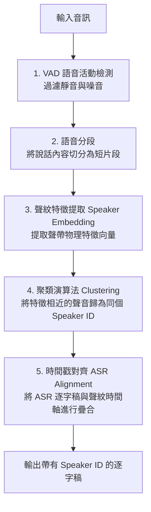
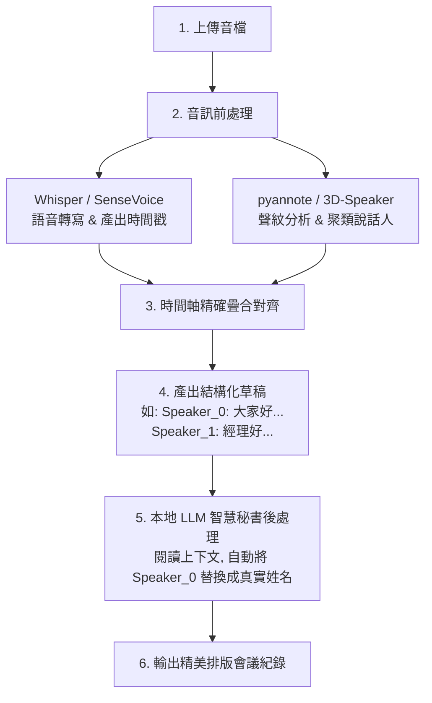

# 中文發言人標記 (Speaker Diarization) 技術評估與比較筆記

本筆記旨在記錄與評估針對中文語音環境下，進行「發言人標記 (Speaker Diarization / 說話人識別)」的各種主流技術方案，並對比目前專案所採用的純 LLM 推測方法，為未來專案功能升級提供技術路徑參考。

---

## 1. 目前專案的設計與局限

目前專案（Breeze ASR AI 智慧會議秘書）在發言人標記功能上，採用的是 **「純 LLM 語意推測」** 的後處理做法：
* **實現方式**：在 `app.py` 中，將 Whisper 轉錄出的純文字直接送給本地的 `Gemma-4` 大模型，透過 Prompt 指示模型根據上下文關係、口語稱呼、語氣轉折進行邏輯分段並標註講者。
* **優勢**：
  * **0 額外系統開銷**：不需載入重型的聲紋辨識模型，也不需處理複雜的音訊時間軸對齊。
  * 對於發言結構清晰、對話中常提及對方姓名（如「小明說...」）的文本，排版效果優良。
* **局限與痛點**：
  * **缺乏聲學物理特徵**：LLM 無法「聽到」聲音，當多人頻繁交替發言且無名字線索時，完全依靠語意「硬猜」，極易出錯。
  * **幻覺與文本改寫**：當對話極為複雜或口語化時，LLM 容易產生幻覺、混淆講者，甚至會自主改寫或漏掉部分逐字稿文字。
  * **無精確時間戳**：無法給出每個講者說話的精確開始與結束時間。

---

## 2. 聲學發言人標記 (Speaker Diarization) 的標準流程

在語音訊號處理領域，真正精確的「發言人標記」是在**音訊特徵層面**進行分析，其標準流水線（Pipeline）如下：

---

## 3. 中文場景下主流方案對比

在中文語音環境下，網路上與開源社群針對幾種主流的本地端 (Local/Offline) 及雲端方案進行了實測對比：

### 📊 綜合比較表

| 方案名稱 | 核心技術架構 | 中文識別與對齊精度 | 系統複雜度 | 本地運行硬體要求 | 適合場景 |
| :--- | :--- | :--- | :--- | :--- | :--- |
| **純 LLM 推測** *(目前做法)* | 文字上下文語意推導 | **低至中** (無物理聲紋，易出錯) | **極低** (不需處理音訊) | 低 (只需執行 LLM) | 訪談發言結構清晰、帶有明確人名指引的快速整理。 |
| **pyannote.audio** | 聲紋特徵提取 + 聚類 | **中至高** (聲音區分精準，但需自行處理對齊) | **高** (需自行撰寫時間軸疊合程式) | 中等 (建議 GPU，但可 CPU) | 具備深度客製化需求，想單獨對聲紋辨識做微調的開發。 |
| **WhisperX** | Faster-Whisper + pyannote + Wav2Vec2 | **高** (強對齊技術解決了中文字句錯位問題) | **中等** (開源套件封裝良好，易整合) | 高 (需顯存/GPU 支援較流暢) | **開源本地端首選**，需要精準「字詞級時間戳」與發言人標記。 |
| **FunASR + 3D-Speaker** | 阿里語音框架 + SenseVoice + 3D-Speaker | **極高** (針對中文/方言深度優化，斷句標點最漂亮) | **高** (與 Whisper 生態不同，需重構後端) | 中至高 (有針對 CPU/GPU 優化) | **中文語境效果最好**，且需要方言識別、情感偵測的場景。 |
| **商業雲端 API** *(Azure / 騰訊 / 阿里)* | 雲端大型聲紋與 ASR 服務 | **天花板級** (多人插話、背景雜音適應力最強) | **極低** (呼叫 API 即可) | 無 (雲端運算) | 預算充足、可聯網、對會議紀錄準確度有極致要求的企業應用。 |

---

## 4. 中文場景下的關鍵技術眉角

根據開源社群對中文語境的實測報告，有以下幾個關鍵發現：

### 💡 字句錯位問題 (Alignment)
* **痛點**：原生的 Whisper 句子級時間戳不夠精準，直接與聲紋聚類（Diarization）時間軸疊合時，常會發生「A 講的最後幾個字，被分給剛準備開口的 B」的字句錯位現象。
* **解決方案**：**WhisperX** 藉由引入 **Wav2Vec2 強制對齊（Forced Alignment）** 技術，能將逐字稿中的「每一個中文字」精確釘在毫秒級時間軸上，完美解決了字句錯位的問題，這也是為什麼它是目前開發者公認開源界最省心的第一選擇。

### 💡 中文本土化優勢 (FunASR)
* **痛點**：國外開發的 VAD 模型與標點預測模型在處理中文「語氣詞（啊、啦、呢）」或長句斷句時，格式往往不夠自然。
* **解決方案**：阿里巴巴達摩院開源的 **FunASR** 框架搭配 **SenseVoice**（ASR 模型）及 **3D-Speaker**（說話人識別），在處理中文、粵語及多種中國地方方言的實測中，其 VAD 精準度、中文標點斷句、以及聲紋區分正確率（DER），皆顯著高於西方主流的開源模型，是目前中文語境下本地端最頂級的解決方案。

---

## 5. 專案未來升級技術路徑建議

若本專案未來計劃引入真正的「聲學發言人標記」，建議採用 **「聲學判斷為主，LLM 潤飾為輔」** 的複合架構：

### 具體實施路徑：
* **短期方案（最快見效）**：將後端的 `whisper.cpp` 部分升級為 **WhisperX** 的 Python 服務。使用 WhisperX 產出帶有 `speaker` 標籤的 JSON 檔後，直接渲染至前端，並將 `Speaker_X` 的格式文字傳給 Gemma-4 進行名字替換與會議記錄整理。
* **長期方案（中文極致優化）**：將後端重構為以 **FunASR** 作為主要的語音引擎，搭配 **SenseVoice** 處理高精度的中文/粵語轉寫，並使用 **3D-Speaker** 進行本土化的發言人標記，建構出最強的離線繁中會議秘書系統。
